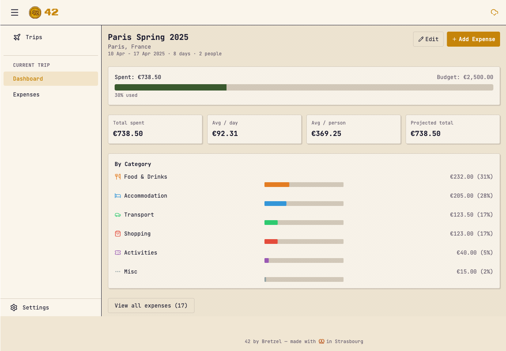

[](https://github.com/bretzel-app/42/actions/workflows/ci.yml)
[](LICENSE)
[](https://github.com/bretzel-app/42/pkgs/container/42)

<p align="center">
  
</p>

# 42 by Bretzel

A self-hostable, offline-first holiday budget tracking app. Track trip expenses in multiple currencies, view real-time spending analytics, and never lose data offline. Part of the [Bretzel](https://bretzel.app) app universe.

<p align="center">
  
</p>

## Install

### Docker (Recommended)

```yaml
# docker-compose.yml
services:
  42:
    image: ghcr.io/bretzel-app/42:latest
    ports:
      - "3000:3000"
    volumes:
      - 42-data:/data
    environment:
      - ORIGIN=https://trips.example.com
    restart: unless-stopped

volumes:
  42-data:
```

```bash
docker compose up -d
```

Open http://localhost:3000 and create your admin account on first visit.

### Manual (Node.js)

```bash
git clone <repo-url> 42 && cd 42
pnpm install
pnpm build
DATABASE_URL=./data/42.db ORIGIN=http://localhost:3000 node build
```

### Development

```bash
pnpm install
pnpm dev
```

Run `make help` to see all available commands, or use pnpm directly:

```bash
pnpm test          # Unit + E2E tests
pnpm check         # Type checking
pnpm build         # Production build
```

## Features

- Create trips with budgets, dates, destinations, and group size
- Log expenses in any currency with manual exchange rates
- Live dashboard — budget gauge, daily spend chart, category breakdown, projections
- Six built-in categories: Food, Accommodation, Transport, Activities, Shopping, Misc
- Multi-currency support with per-trip exchange rate management
- PWA — installable, works offline via IndexedDB + LWW CRDT sync
- Multi-user auth (Argon2) with admin/user roles
- Docker deployment with a single command

## Tech Stack

| Layer | Technology |
|-------|-----------|
| Framework | SvelteKit 2 (Svelte 5 runes) |
| Language | TypeScript (strict) |
| UI | Tailwind CSS 4 |
| Database | SQLite (better-sqlite3) + Drizzle ORM |
| Client DB | IndexedDB (idb) |
| Sync | LWW CRDTs |
| Auth | Argon2 + session cookies |
| Charts | Pure SVG (no libraries) |
| Testing | Vitest + Playwright |
| Container | Docker (multi-stage) |
| CI/CD | GitHub Actions |

## CI/CD

- **CI** — lint, type check, unit tests, E2E tests, Docker build on every push/PR
- **Release** — builds and pushes Docker image on `v*` tags

Configure registry via GitHub Secrets: `REGISTRY_URL`, `REGISTRY_USER`, `REGISTRY_TOKEN`.

## License

[MIT](LICENSE)
